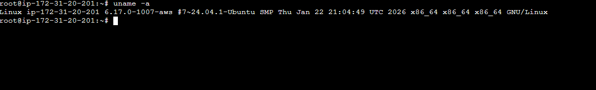
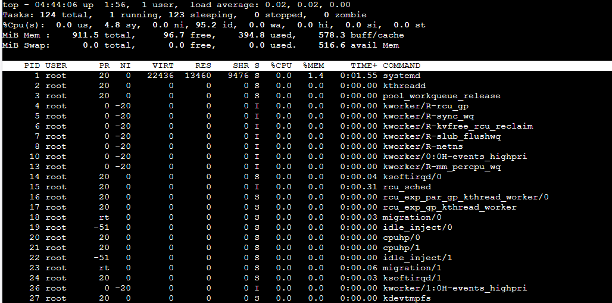
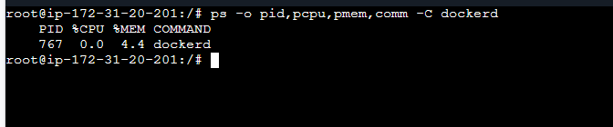
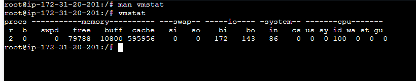
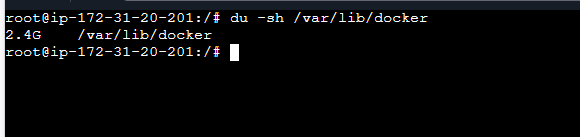
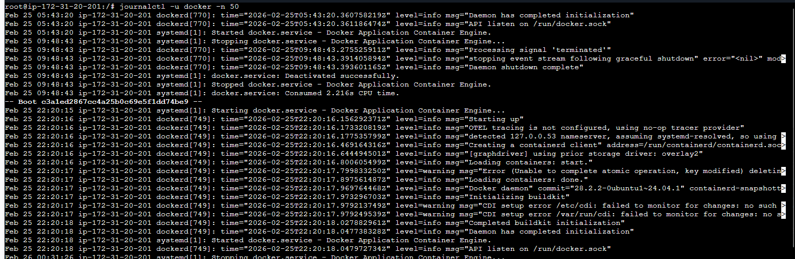

# 📘 Day 05 – Linux Troubleshooting Drill  
## 🎯 Target Service: Docker (`docker.service`)

This runbook documents a structured troubleshooting drill covering:

- Environment validation  
- Filesystem sanity  
- CPU & Memory  
- Disk & Storage  
- Network  
- Logs & Service health  
- Escalation strategy  

---

# 1️⃣ Environment Basics

## 🔹 uname -a


- Linux → OS Kernel  
- AWS optimized kernel  
- x86_64 → 64-bit architecture  

---

## 🔹 cat /etc/os-release


- Ubuntu 24.04.3 LTS  
- Noble Numbat  
- Debian-based system  

---

# 2️⃣ Filesystem Sanity Check

## 🔹 mkdir + cp + ls


- Directory created successfully  
- File copied without errors  
- Normal permissions  

---

# 3️⃣ CPU & Memory Analysis

## 🔹 top


- Load average very low  
- CPU mostly idle  
- No system pressure  

---

## 🔹 htop


- containerd running normally  
- No high CPU processes  

---

## 🔹 ps -C dockerd


- Docker CPU usage near 0%  
- Memory usage stable  

---

## 🔹 free -h


- Available memory ~516MB  
- No swap usage  

---

## 🔹 vmstat


- No swapping  
- No IO wait  
- CPU idle  

---

# 4️⃣ Disk & Storage

## 🔹 df -h


- Root usage 38%  
- Enough free space  

---

## 🔹 du -sh /var/lib/docker


- Docker storage ~2.4GB  

---

## 🔹 du -sh /var/log


- Logs ~67MB  
- No log overflow  

---

# 5️⃣ Network Check

## 🔹 ss -tulpn


- Port 80 → nginx  
- Port 22 → SSH  
- containerd local socket  

---

## 🔹 curl -I http://localhost


- HTTP/1.1 200 OK  
- nginx responding properly  

---

# 6️⃣ Logs & Service Status

## 🔹 systemctl status docker


- Active: running  
- Memory usage ~57MB  

---

## 🔹 journalctl -u docker -n 50


- Docker initialized correctly  
- No fatal errors  
- Only non-critical warnings  

---

# 🔎 Final Health Summary

| Component | Status |
|-----------|--------|
| CPU | Healthy |
| Memory | Healthy |
| Disk | Safe |
| Docker | Running |
| Network | OK |
| Logs | Clean |

---

# 🚨 Escalation Plan

## 1️⃣ Check Container Usage

```
docker stats
```

Use when container consumes high CPU or memory.

---

## 2️⃣ Restart Docker

```
systemctl restart docker
```

Use when:
- Docker daemon unresponsive  
- Containers fail unexpectedly  

---

## 3️⃣ Inspect Container

```
docker inspect <container_id>
```

Provides:
- Restart policy  
- Environment variables  
- Network configuration  
- Error states  

---

## 4️⃣ Deep Debug (Process-Level)

```
pidof dockerd
strace -p <dockerd_pid>
```

Use when:
- Docker stuck  
- High CPU without clear reason  
- Suspected system-level issue  

---

⭐ Part of #90DaysOfDevOps
