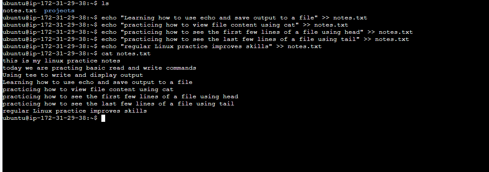

# Day 06 – Linux Fundamentals: Read and Write Text Files

# Task

**This is a continuation of Day 05, but much simpler.**

Today’s goal is to practice basic file read/write using only fundamental commands.

You will create a small text file and practice:

    Creating a file
    Writing text to a file
    Appending new lines
    Reading the file back


---

##  Objective

This practice covers:

- File creation
- Overwriting vs appending
- Reading full file content
- Viewing partial content
- Using `tee` command
- Verifying outputs

---

# 1️⃣ File Creation & Initial Write

### 🔹 Commands Executed

```bash
ls
echo "this is my linux practice notes" > notes.txt
echo "today we are practicing basic read and write commands" >> notes.txt
cat notes.txt
```

###  What This Does

- `ls` → Lists files in the working directory.
- `>` → Creates or overwrites the file.
- `>>` → Appends new data to existing file.
- `cat` → Displays the entire file content.

###  Output Screenshot

<p align="center">
  
</p>

---

# 2️⃣ Using tee (Append + Display)

### 🔹 Commands Executed

```bash
echo "Using tee to write and display output" | tee -a notes.txt
cat notes.txt
```

###  What This Does

- `tee -a` → Appends content to file.
- Simultaneously prints output to terminal.
- `cat` confirms updated file content.

###  Output Screenshot

<p align="center">
  
</p>

---

# 3️⃣ Multiple Append & Final Verification

### 🔹 Commands Executed

```bash
echo "Learning how to use echo and save output to a file" >> notes.txt
echo "practicing how to view file content using cat" >> notes.txt
echo "practicing how to see the first few lines of a file using head" >> notes.txt
echo "practicing how to see the last few lines of a file using tail" >> notes.txt
echo "regular Linux practice improves skills" >> notes.txt

cat notes.txt
head -n 2 notes.txt
tail -n 2 notes.txt
```

###  What This Does

- Appends multiple lines using `>>`
- `cat` → Shows complete file
- `head -n 2` → Displays first two lines
- `tail -n 2` → Displays last two lines

###  Output Screenshot

<p align="center">
  
</p>

---

# Command Summary

| Command | Purpose |
|----------|----------|
| `ls` | List directory files |
| `>` | Overwrite or create file |
| `>>` | Append to file |
| `tee -a` | Append + display |
| `cat` | Show full file |
| `head -n` | Show first lines |
| `tail -n` | Show last lines |

---

#  Learning Outcome

 - Clear understanding of file redirection  
 - Practical difference between overwrite and append  
 - Proper verification of file content  
 - Strengthened Linux fundamentals  

---

# Why This Matters for DevOps

Reading and writing files is a daily task in DevOps.

Logs, configs, and scripts are all text files.
If you can handle files quickly, you can debug and automate faster.

---
