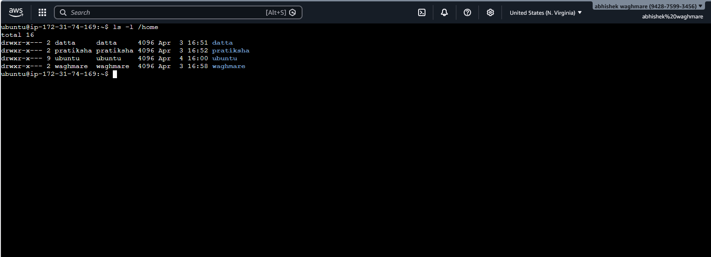
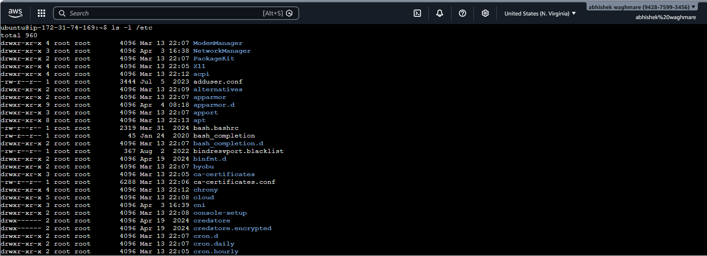
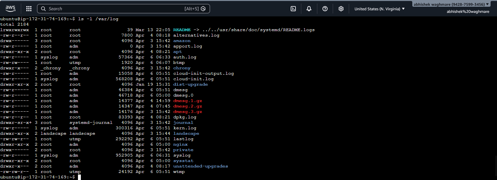
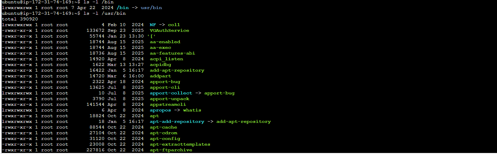

# 📘 Day 07 – Linux File System & Troubleshooting Notes

This document covers Linux file system structure, hands-on practice, and real-world DevOps troubleshooting scenarios.

---

# 📁 Linux File System Overview

## 📁 / (Root Directory)

<p align="center">
  
</p>

- Top-level directory of Linux  
- Everything starts from here  
- Command: `ls -l /`  
- Example: home, etc, var  
- Use Case: Explore full system  

---

## 📁 /home

<p align="center">
  
</p>

- Stores user directories  
- Command: `ls -l /home`  
- Example: ubuntu, datta  
- Use Case: User data access  

---

## 📁 /root

<p align="center">
  
</p>

- Root (admin) home  
- Command: `ls -l /root`  
- Use Case: Admin-level tasks  

---

## 📁 /etc

<p align="center">
  
</p>

- Configuration files  
- Command: `ls -l /etc`  
- Example: hostname, passwd  
- Use Case: Debug configs  

---

## 📁 /var/log

<p align="center">
  
</p>

- System logs  
- Command: `ls -l /var/log`  
- Use Case: Troubleshooting  

---

## 📁 /tmp

<p align="center">
  
</p>

- Temporary files  
- Command: `ls -l /tmp`  

---

## 📁 /bin & /usr/bin

<p align="center">
  
</p>

- System binaries  
- Examples: ls, cp, mv, python3  
- Use Case: Run commands  

---

## 📁 /opt

- Third-party software  
- Command: `ls -l /opt`  

---

# 🧪 Hands-on Tasks

## 🔍 1. Find Largest Log Files

```bash
du -sh /var/log/* 2>/dev/null | sort -h | tail -5
