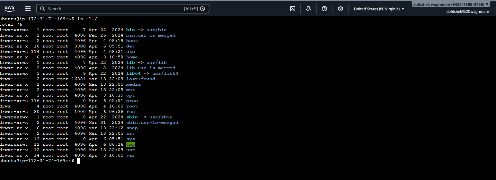
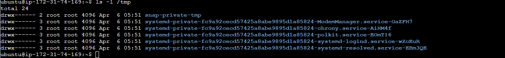
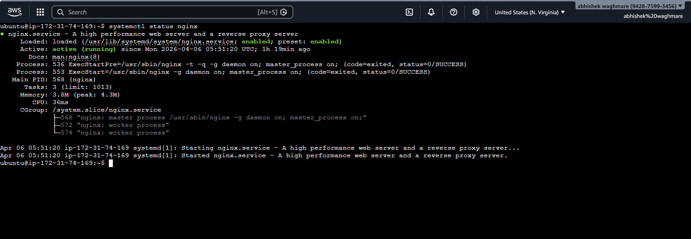

# 📘 Day 07 – Linux File System & Troubleshooting Notes

This document covers Linux file system structure, hands-on practice, and real-world troubleshooting scenarios.

---

# 📁 Linux File System Overview

## 📁 / (Root Directory)

<p align="center">
  
</p>

- Top-level directory of Linux  
- Everything starts from here  
- Command: `ls -l /`  
- Example: home, etc, var  

---

## 📁 /home

<p align="center">
  
</p>

- Stores user directories  
- Command: `ls -l /home`  
- Example: ubuntu, datta  

---

## 📁 /root

<p align="center">
  
</p>

- Root (admin) home  
- Command: `ls -l /root`  

---

## 📁 /etc

<p align="center">
  
</p>

- Configuration files  
- Command: `ls -l /etc`  
- Example: hostname, passwd  

---

## 📁 /var/log

<p align="center">
  
</p>

- System logs  
- Command: `ls -l /var/log`  

---

## 📁 /tmp

<p align="center">
  
</p>

- Temporary files  
- Command: `ls -l /tmp`  

---

## 📁 /bin & /usr/bin

<p align="center">
  
</p>

- System binaries  
- Examples: ls, cp, mv, python3  

---

## 📁 /opt

- Third-party software  
- Command: `ls -l /opt`  

---

# 🧪 Hands-on Tasks

## 🔍 1. Find Largest Log Files

```bash
du -sh /var/log/* 2>/dev/null | sort -h | tail -5


## 🖼️ **Output**

<p align="center">
  
</p>

## **✅ What this does**

- Shows file sizes
- Hides permission errors
- Sorts by size
- Displays top 5 largest

## 🧠 Learning
Observation: /var/log/journal is largest
Log files can fill disk space


⚙️ 2. View System Configuration
- Command: `cat /etc/hostname'

## 🖼️ Output

<p align="center">
  
</p>

## 🧠 Learning
Hostname: **ip-172-31-74-169**
Helps identify server

## 🏠 3. Check Home Directory
- Command: `ls -la ~'

##🖼️ Output

<p align="center">
  
</p>

## 🧠 Learning
Hidden files: .bashrc, .profile, .ssh
Stores user configs


# 📘 Day 07 – Linux Troubleshooting (Nginx Scenario)

This document demonstrates real-world troubleshooting of an Nginx service using standard Linux commands.

---

# 🌐 Scenario: Nginx Service Issue

---

## 🔹 Step 1: Check Service Status

```bash
systemctl status nginx

<p align="center">
  
</p>

Why:
Check if the service is running, failed, or inactive


