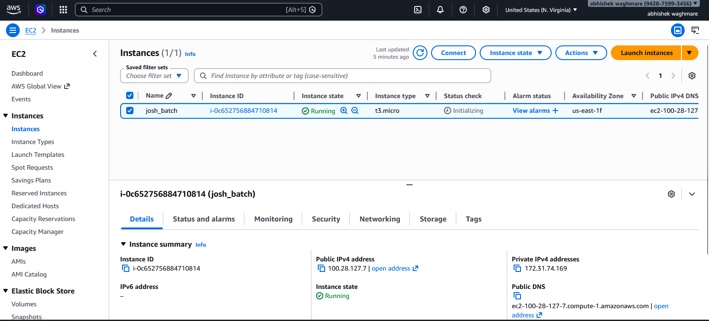
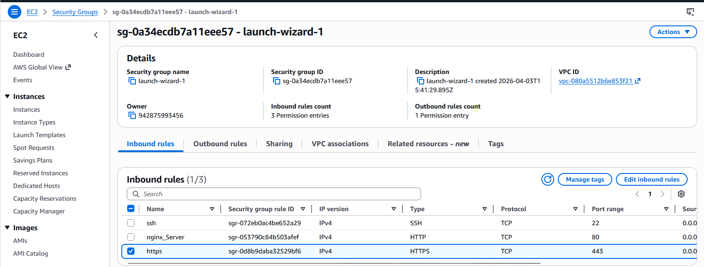
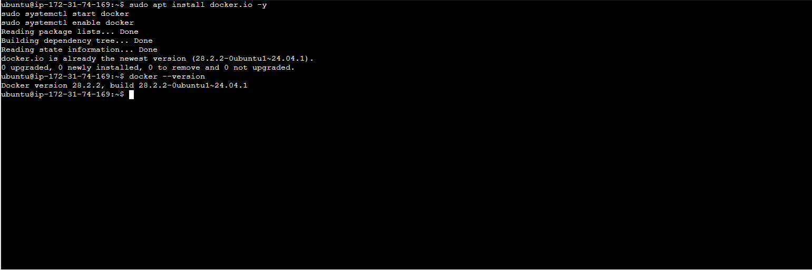
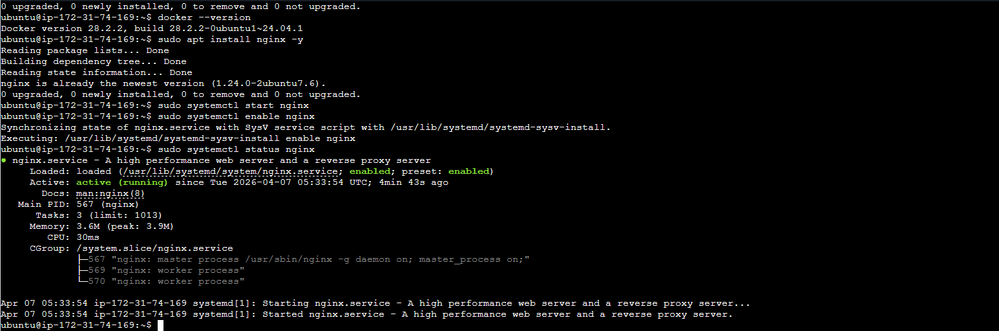
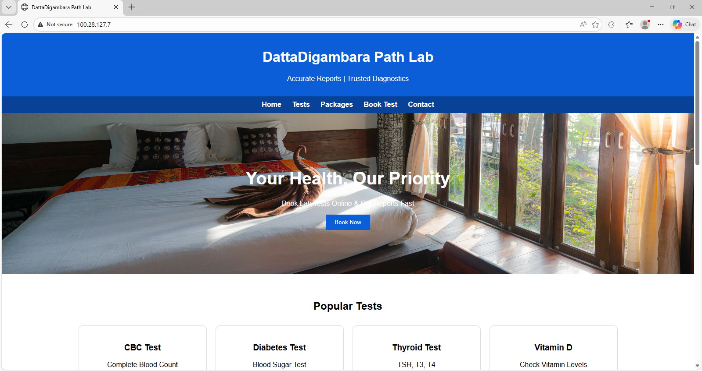

# 🚀 Day 08 – Cloud Server Setup: Docker, Nginx & Web Deployment

## 📌 Overview
This project demonstrates how to deploy a production-ready web server on AWS EC2, configure Nginx, manage firewall rules, and monitor logs — essential DevOps skills used in real-world environments.

---

## 🎯 Objectives
- Launch and configure a cloud server  
- Connect securely using SSH  
- Install Docker and Nginx  
- Configure Security Groups (Firewall)  
- Deploy a website using Nginx  
- Monitor and download logs  

---

## 🏗️ Architecture Workflow
Local Machine → SSH → EC2 Instance → Install Docker & Nginx → Open Ports → Deploy Website → Access via Browser

---

## ⚙️ 1. Launch EC2 Instance

- Provider: AWS EC2  
- OS: Ubuntu  
- Instance Type: t2.micro  
- Key Pair: `.pem` file  

### 📸 EC2 Instance Running

---

## 🔐 2. Configure Security Group

| Type | Port | Purpose |
|------|------|--------|
| SSH  | 22   | Remote Access |
| HTTP | 80   | Web Access |
| HTTPS | 443 | Secure Access |

### 📸 Security Group Rules

---

## 🔑 3. Connect via SSH

chmod 400 your-key.pem
ssh -i your-key.pem ubuntu@100.28.127.7
----

## 🔄 4. Update System

## sudo apt update && sudo apt upgrade -y

---

## 🐳 5. Install Docker

sudo apt install docker.io -y

sudo systemctl start docker

sudo systemctl enable docker

docker --version

### 📸 Docker

---

## 🌐 6. Install & Start Nginx

sudo apt install nginx -y

sudo systemctl start nginx

sudo systemctl enable nginx

sudo systemctl status nginx

---

## 🚀 7. Deploy Website

cd /var/www/html/

sudo vim index.html

---

## Restart Nginx

sudo systemctl restart nginx

---

## 🌍 8. Access Website

Open in browser:

## http://100.28.127.7

