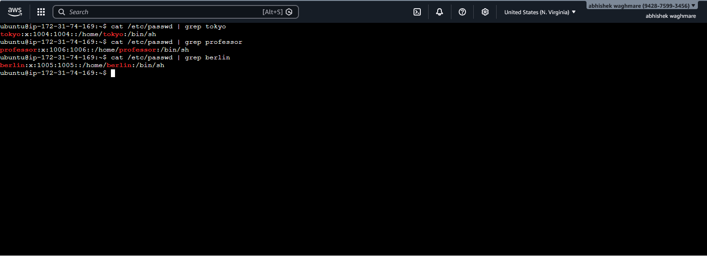
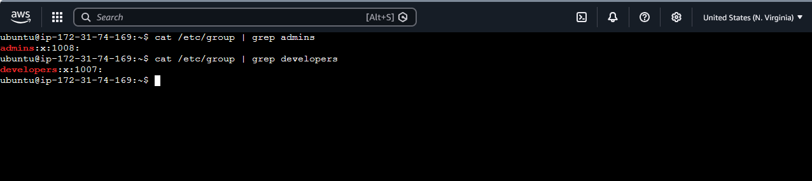
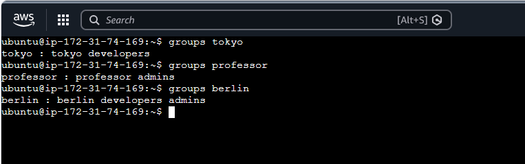

# 📘 Day 09 – Linux User & Group Management Challenge

## 🚀 Objective
Practice real-world Linux user and group management:
- Create users and set passwords
- Create and manage groups
- Assign users to groups
- Configure shared directories with permissions

---

## 👥 Users & Groups Created

### Users
- tokyo
- berlin
- professor
- nairobi

### 📸 Users Created

### Groups
- developers
- admins
- project-team

### 📸 Groups Created

---

## 🔗 Group Assignments

| User       | Groups Assigned              |
|------------|-----------------------------|
| tokyo      | developers, project-team    |
| berlin     | developers, admins          |
| professor  | admins                      |
| nairobi    | project-team                |

### 📸 Group Assignments

---

## 📁 Directories Created

| Directory              | Group Owner   | Permissions |
|------------------------|--------------|-------------|
| /opt/dev-project       | developers   | 775         |
| /opt/team-workspace    | project-team | 775         |

---

## ⚙️ Commands Used

### 🔹 Create Users

sudo useradd -m tokyo
sudo passwd tokyo

sudo useradd -m berlin
sudo passwd berlin

sudo useradd -m professor
sudo passwd professor

---

### 🔹 Verify Users

cat /etc/passwd | grep tokyo
ls /home

---

### 🔹 Create Groups

sudo groupadd developers
sudo groupadd admins

---

### 🔹 Verify Groups

cat /etc/group | grep developers

---

### 🔹 Assign Users to Groups

sudo usermod -aG developers tokyo

sudo usermod -aG developers berlin

sudo usermod -aG admins berlin

sudo usermod -aG admins professor

---

### 🔹 Verify Group Membership

groups tokyo
groups berlin
groups professor

---

### 🔹 Create Shared Directory

sudo mkdir -p /opt/dev-project

sudo chgrp developers /opt/dev-project

sudo chmod 775 /opt/dev-project

---

### 🔹 Test Shared Access

sudo -u tokyo touch /opt/dev-project/tokyo.txt

sudo -u berlin touch /opt/dev-project/berlin.txt

---

### 🔹 Team Workspace Setup

sudo useradd -m nairobi
sudo passwd nairobi

sudo groupadd project-team

sudo usermod -aG project-team nairobi
sudo usermod -aG project-team tokyo

sudo mkdir -p /opt/team-workspace
sudo chgrp project-team /opt/team-workspace
sudo chmod 775 /opt/team-workspace

---

### 🔹 Final Test

sudo -u nairobi touch /opt/team-workspace/test.txt

---
