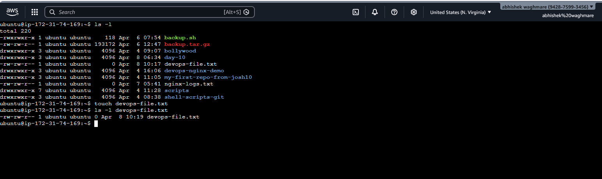
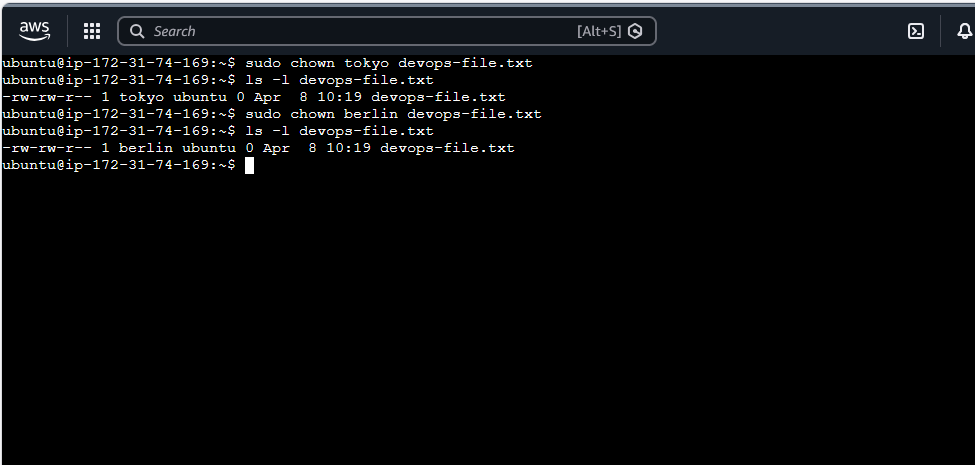
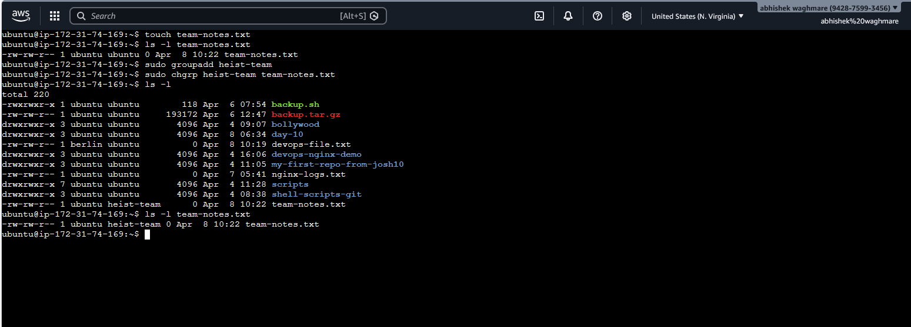
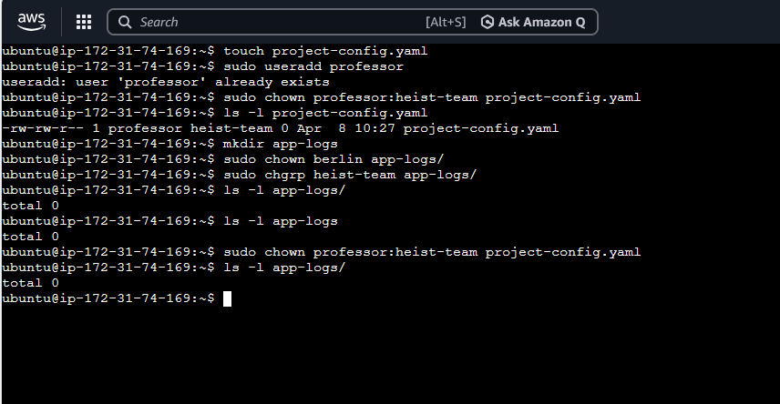
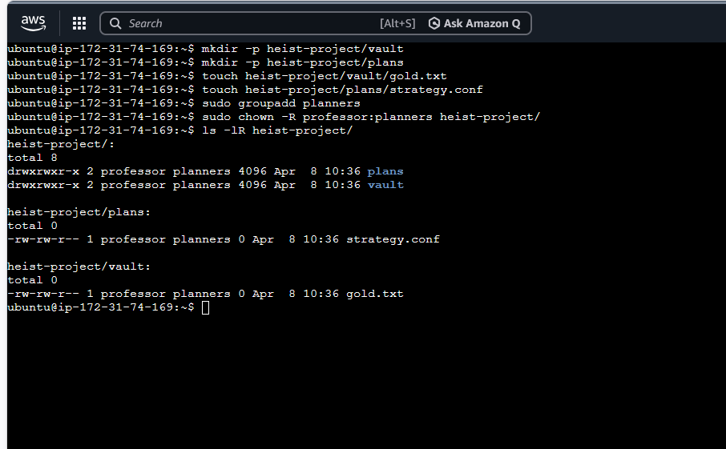
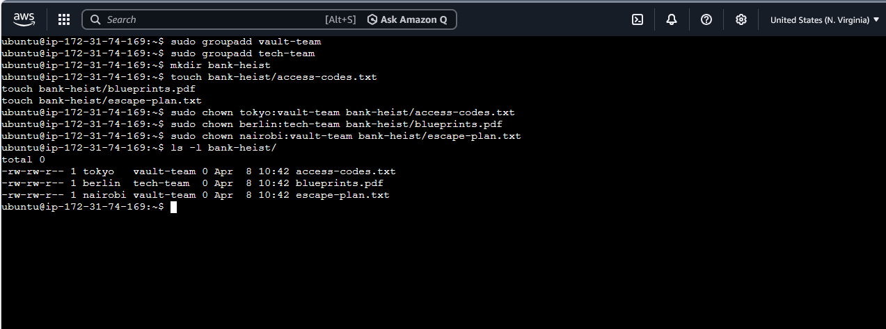

# Day 11 – File Ownership Challenge (chown & chgrp)

Today I practiced Linux file and directory ownership using chown and chgrp.
This helps in managing access control for applications and shared directories.

---

## Task 1: Understanding Ownership

```bash
ls -l ~
```

Format:
-rw-r--r-- 1 owner group size date filename

Owner → user who owns the file  
Group → group that shares access

---




## Task 2: Basic chown Operations

```bash
touch devops-file.txt
ls -l devops-file.txt
sudo chown tokyo devops-file.txt
sudo chown berlin devops-file.txt
ls -l devops-file.txt
```


---

## Task 3: Basic chgrp Operations

```bash
touch team-notes.txt
sudo groupadd heist-team
sudo chgrp heist-team team-notes.txt
ls -l team-notes.txt
```


---

## Task 4: Change Owner & Group Together

```bash
touch project-config.yaml
sudo chown professor:heist-team project-config.yaml

mkdir app-logs
sudo chown berlin:heist-team app-logs
ls -ld app-logs
```

---

## Task 5: Recursive Ownership

```bash
mkdir -p heist-project/vault
mkdir -p heist-project/plans
touch heist-project/vault/gold.txt
touch heist-project/plans/strategy.conf

sudo groupadd planners
sudo chown -R professor:planners heist-project
ls -lR heist-project
```
.
---

## Task 6: Practice Challenge

```bash
sudo useradd tokyo
sudo useradd berlin
sudo useradd nairobi
---

sudo groupadd vault-team
sudo groupadd tech-team
---

mkdir bank-heist
touch bank-heist/access-codes.txt
touch bank-heist/blueprints.pdf
touch bank-heist/escape-plan.txt
---

sudo chown tokyo:vault-team bank-heist/access-codes.txt
sudo chown berlin:tech-team bank-heist/blueprints.pdf
sudo chown nairobi:vault-team bank-heist/escape-plan.txt

ls -l bank-heist
```
.
---

## What I Learned
- Ownership controls file access
- chown changes owner and group
- chgrp changes only group
- Recursive ownership is useful
