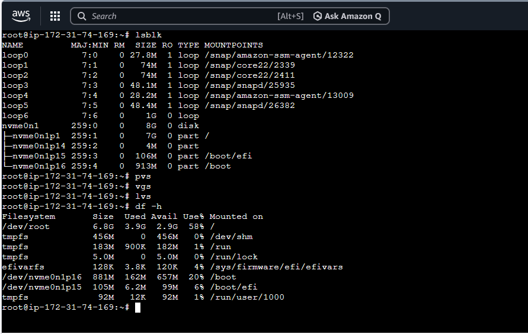
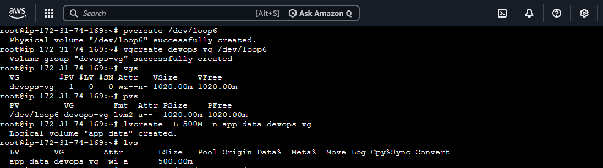
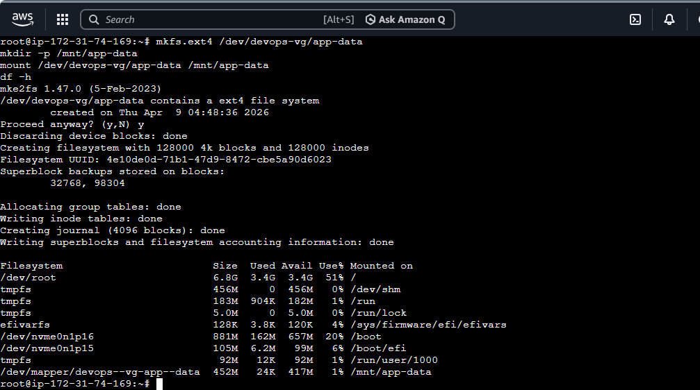
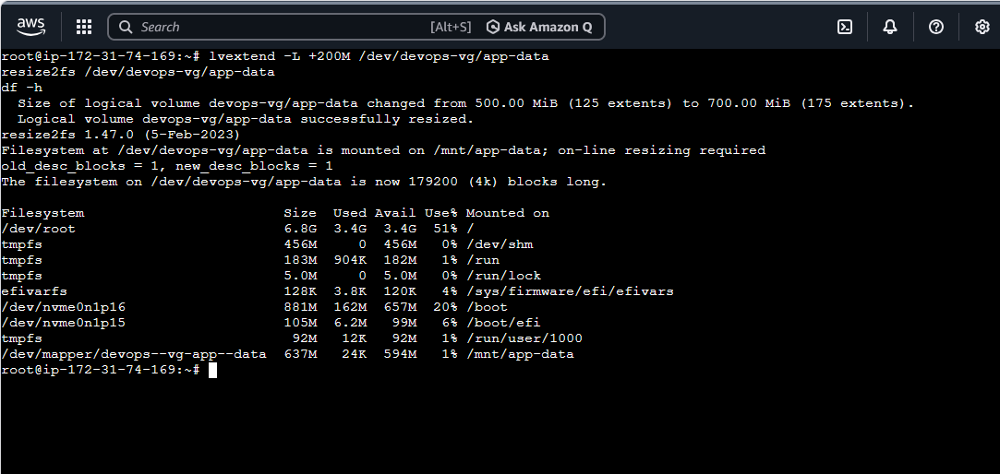

# Day 13 – Linux Volume Management (LVM)

## 📌 Objective
Learn how to manage storage using LVM by creating, extending, and mounting logical volumes.

---
## Commands Used

### 1. Check Current Storage
```bash
lsblk      # List all block devices and partitions
pvs        # Show existing physical volumes
vgs        # Show existing volume groups
lvs        # Show existing logical volumes
df -h      # Show mounted filesystems and their usage
```

### 2. Create Physical Volume
```bash
pvcreate /dev/loop6   # Initialize /dev/nvme1n1 as a physical volume for LVM
pvs                      # Verify physical volume creation
```

### 3. Create Volume Group
```bash
vgcreate devops-vg /dev/loop6   # Create a volume group named devops-vg
vgs                                # Verify volume group creation
```

### 4. Create Logical Volume
```bash
lvcreate -L 500M -n app-data devops-vg   # Create a logical volume named app-data with 500MB
lvs                                       # Verify logical volume creation
```

### 5. Format and Mount Logical Volume
```bash
mkfs.ext4 /dev/devops-vg/app-data               # Format LV with ext4 filesystem
mkdir -p /mnt/app-data                          # Create mount point
mount /dev/devops-vg/app-data /mnt/app-data    # Mount LV
df -h /mnt/app-data                             # Verify mounted filesystem size and usage
```

### 6. Extend Logical Volume
```bash
lvextend -L +200M /dev/devops-vg/app-data   # Extend LV by 200MB
resize2fs /dev/devops-vg/app-data           # Resize filesystem to use new space
df -h /mnt/app-data                           # Verify updated size and usage
```


## Task 1: Check Current Storage

**Commands run:**
```bash
lsblk
pvs
vgs
lvs
df -h
```


**Observation:**

nvme0n1 → OS disk (DO NOT USE)

loop6 → Virtual disk (used for LVM)

---

## Task 2: Create Physical Volume

**Command:**
```bash
pvcreate /dev/loop6
pvs
```

## Task 3: Create Volume Group

**Command:**
```bash
vgcreate devops-vg /dev/loop6
vgs
```
---

## Task 4: Create Logical Volume

**Command:**
```bash
lvcreate -L 500M -n app-data devops-vg
lvs
```


---

## Task 5: Format and Mount Logical Volume

**Commands:**
```bash
mkfs.ext4 /dev/devops-vg/app-data
mkdir -p /mnt/app-data
mount /dev/devops-vg/app-data /mnt/app-data
df -h /mnt/app-data
```


---

## Task 6: Extend Logical Volume

**Commands:**
```bash
lvextend -L +200M /dev/devops-vg/app-data
resize2fs /dev/devops-vg/app-data
df -h /mnt/app-data
```


---

## Key Learnings

1. How to initialize a physical disk for LVM (`pvcreate`)  
2. How to create a volume group (`vgcreate`) and logical volume (`lvcreate`)  
3. How to extend a logical volume and resize the filesystem (`lvextend` + `resize2fs`)
