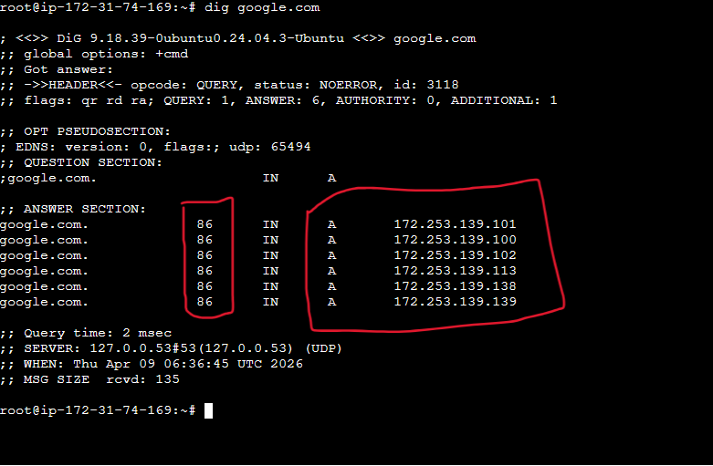
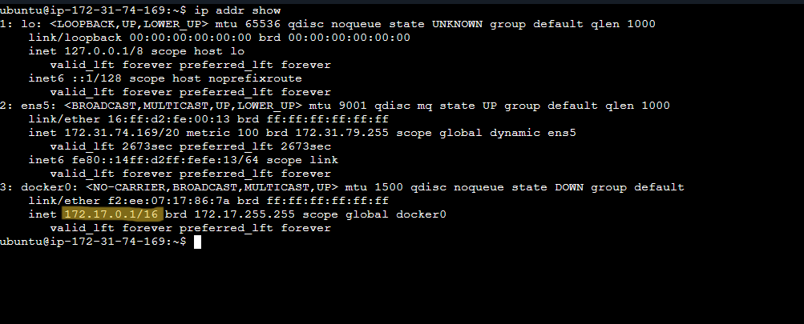
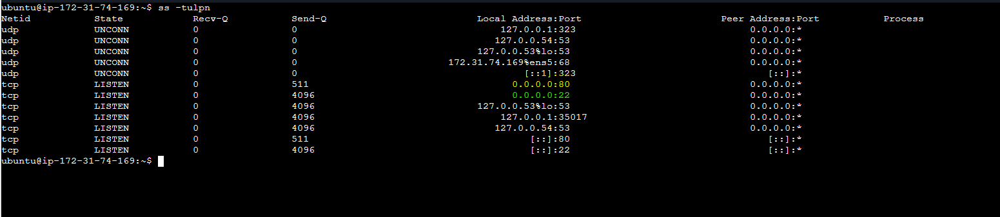

## Day 15 – Networking Concepts: DNS, IP, Subnets & Ports

## Task

Build on Day 14 by understanding the building blocks of networking every DevOps engineer must know.

## Task 1: DNS – How Names Become IPs

### 1. What happens when you type `google.com` in a browser
1. Browser checks its cache; if a miss → OS resolver checks.
2. Resolver queries DNS server → root → TLD → authoritative DNS server.
3. Authoritative server returns IP (A/AAAA) record.
4. Browser initiates TCP connection → HTTP/HTTPS request → page loads.

### 2. DNS Record Types

| Record Type | Purpose | Example |
| ----------- | ------- | ------- |
| A           | Maps a domain to an IPv4 address | `google.com → 142.250.190.14` |
| AAAA        | Maps a domain to an IPv6 address | `google.com → 2001:4860:4860:0:0:0:0:8888` |
| CNAME       | Alias pointing one domain to another | `www.example.com → example.com` |
| MX          | Specifies mail servers for the domain | `example.com → mail.example.com` |
| NS          | Lists authoritative DNS servers for the domain | `example.com → ns1.example.com, ns2.example.com` |

### 3. Using `dig`
- Command: `dig google.com`  
- Second column shows **TTL** (Time to Live, in seconds). 86 → cache IP for 86 seconds.  
- Last column shows the actual IPv4 addresses (A Records).
  

---

## Task 2: IP Addressing

### 1. What is an IPv4 address?
- 32-bit number divided into 4 octets: `192.168.1.10`  
- Each octet = 8 bits, range 0–255  

| Octet | Decimal | Binary         |
|-------|--------|----------------|
| 1     | 192    | 11000000       |
| 2     | 168    | 10101000       |
| 3     | 1      | 00000001       |
| 4     | 10     | 00001010       |

### 2. Public vs Private IPs

| Type        | Description                     | Example       |
| ----------- | ------------------------------- | ------------- |
| Public      | Accessible on the Internet      | 8.8.8.8      |
| Private     | Used in local networks          | 192.168.1.10 |

### 3. Private IP Ranges
- `10.0.0.0 – 10.255.255.255`  
- `172.16.0.0 – 172.31.255.255`  
- `192.168.0.0 – 192.168.255.255`  

### 4.Run: ip addr show
- Command: `ip addr show`  
- Example private IP: `inet 172.17.0.1/16`

 

---

## Task 3: CIDR & Subnetting

### 1. What does `/24` mean in `192.168.1.0/24`?
- 24 bits = **network portion**
Remaining 8 bits = host portion

### 2. Usable hosts in different subnets
Formula: `Usable Hosts = 2^(32 - CIDR) - 2`  

| CIDR | Usable Hosts |
| ---- | ------------ |
| /24  | 254          |
| /16  | 65,534       |
| /28  | 14           |

### 3. Why subnet?
- To divide a large network into smaller, manageable networks.
- Improves network management
- Enhances security
- Reduces broadcast traffic
- Efficient IP utilization

### 4. Quick Reference Table

| CIDR | Subnet Mask       | Total IPs | Usable Hosts |
| ---- | ---------------- | --------- | ------------  |
| /24  | 255.255.255.0     | 256       | 254          |
| /16  | 255.255.0.0       | 65,536    | 65,534       |
| /28  | 255.255.255.240   | 16        | 14           |

---

## Task 4: Ports – The Doors to Services

### 1. What is a port? Why do we need them?
- Logical communication endpoint
- Allows multiple services on one system
- Works with IP + protocol to route traffic
- Examples: HTTP → 80, SSH → 22, MySQL → 3306

### 2. Common Ports

| Port  | Service |
| ----- | ------- |
| 22    | SSH     |
| 80    | HTTP    |
| 443   | HTTPS   |
| 53    | DNS     |
| 3306  | MySQL   |
| 6379  | Redis   |
| 27017 | MongoDB |

### 3. Matching listening ports
- Command: `ss -tulpn`  
- Example: `22 → SSH`, `80 → HTTP`

 
 
---

## Task 5: Putting It Together

### 1. `curl http://myapp.com:8080` – networking concepts involved
**Involves:**

**DNS** → domain to IP resolution
**TCP** → connection establishment
**HTTP** → request/response protocol
**Port 8080** → specific service routing  

### 2. Database connectivity issue
If app can't reach `10.0.1.50:3306`:
1. Check network connectivity: `ping 10.0.1.50`  
2. Check firewall rules: Ensure port 3306 is open  
3. Check database service: MySQL must be running and listening on 3306  

### What I learned

1. **DNS Resolution is the Backbone of the Internet** – Domain names like google.com are translated into IP addresses through a hierarchy of caches, root/TLD, and authoritative servers, enabling browsers to connect to the right server.

2. **IP Addressing & Subnetting Organize Networks** – Understanding public vs private IPs, CIDR notation, and subnet masks helps manage networks efficiently and calculate usable hosts.

3. **Ports Direct Traffic to the Right Service** – Ports act as “doors” for applications; combined with IPs and protocols like TCP/HTTP, they ensure data reaches the correct service (e.g., web, database, email).

---

